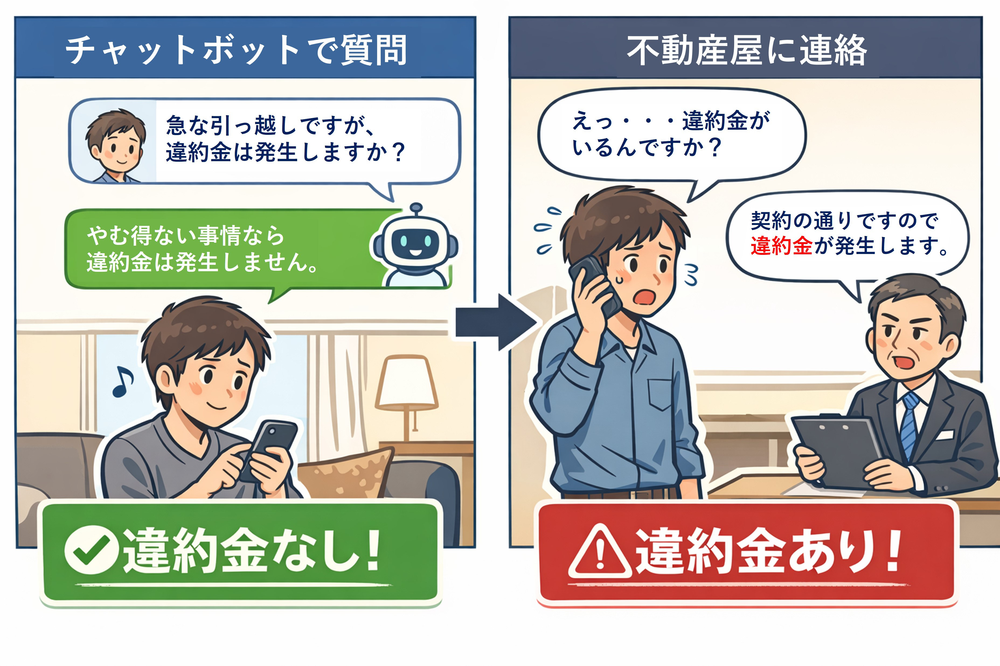
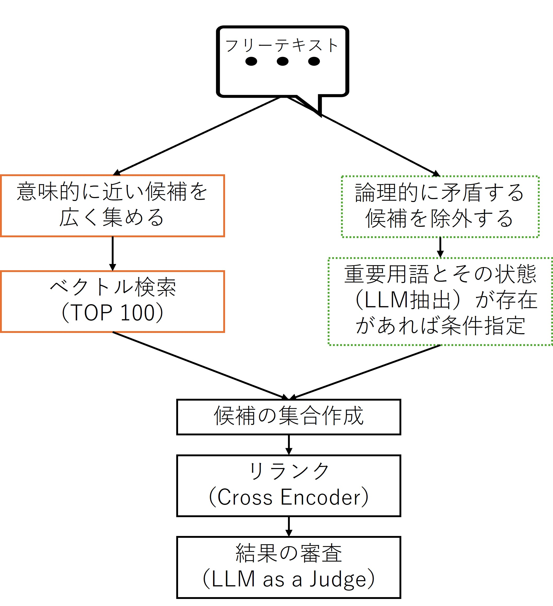

# 意味は似ているのに正反対？ ― ベクトル検索の限界をLLMで補った実践フロー

ベクトル検索は、テキストや画像、音声などをAIモデルで数値ベクトルに変換し、意味的に近いものを探すことができる検索手法です。キーワード検索では難しかった、フリーテキストからの「意味的な類似検索」を可能にします。

ですが、実際に使ってみると「意味は近いけれど、内容としては正反対」の内容が検索上位に含まれるケースがありました。

特に、肯定・否定を区別することが重要な場面では、誤った回答を返すこともあるため、この問題は無視できないものとなります。



そこで、この記事では、ベクトル検索では扱いきれない「論理の違い」をLLMとSQLを組み合わせて補完した構成をご紹介します。

>本記事はアルゴリズム実装解説ではなく、設計パターンの共有を目的としています。

以下の流れでご紹介します。

[(1) なぜベクトル検索だけでは足りないのか](#1-なぜベクトル検索だけでは足りないのか)

[(2) 否定問題はEmbeddingの限界](#2-否定問題はembeddingの限界)

[(3) LLMは検索の前処理・後処理に使ってみよう](#3-llmは検索の前処理後処理に使ってみよう)

[(4) 意味検索 × 論理検索の分離設計](#4-意味検索--論理検索の分離設計)

[(5) リランク（Cross Encoder）とLLM as a Judgeで正しさを証明](#5-リランクcross-encoderとllm-as-a-judgeで正しさを証明)

[(6) IRIS × Embedded Python で検索をDBに閉じ込める](#6-iris--embedded-python-で検索をdbに閉じ込める)

[(7) この設計が向くドメイン／向かないドメイン](#7-この設計が向くドメイン向かないドメイン)

[(8) まとめ](#8まとめ)

[(9) サンプル実行方法](#9サンプル実行方法)


## (1) なぜベクトル検索だけでは足りないのか

まずは、遭遇した「意味は近いけれど、内容としては正反対」の例をご紹介します。

テストに利用した内容ですが、患者が病院を退院する際、医師が作成する退院時サマリを題材とし、フリーテキストの質問文から病名・状態が近い症例を探す目的でベクトル検索を行っています（LLMで生成した架空情報200件でテストしています）。

---

質問文：高熱と咳で入院し **SpO2低下のため短期間酸素投与しました。** 迅速検査でインフルエンザ陽性で、抗菌薬ではなく対症療法中心で改善しました。

以下、TOP 5 の結果です。

`20 - `で始まる行に質問文と反対の意味となる **「SpO2 96%（室内気）で酸素投与は行わなかった。」** が含まれています。
```
194 - 【入院経過】発熱と咳嗽で入院。迅速検査でインフルエンザ陽性。呼吸苦がありSpO2低下に対し酸素投与を短期間実施。肺炎所見は明確でなく対症療法中心に改善し自宅退院。
184 - 【入院経過】発熱・咳嗽・関節痛で入院。迅速検査でインフルエンザ陽性。呼吸苦に対しSpO2低下があり酸素投与を短期間実施。肺炎所見は明確でなく対症療法中心に改善し自宅退院。
20 - 【入院経過】発熱と咳嗽で入院。SpO2 96%（室内気）で酸素投与は行わなかった。限局性肺炎として抗菌薬点滴で治療し改善、退院。ICU入室は行っていない。
41 - 【入院経過】発熱と息切れで入院。SpO2 90〜92%で酸素投与開始。肺炎として抗菌薬点滴で治療し改善、酸素離脱後に退院。ICU入室は行っていない。
17 - 【入院経過】発熱と呼吸困難で入院。SpO2 90〜91%で酸素投与開始。肺炎として抗菌薬点滴治療を行い改善、酸素離脱後に退院。ICU入室は行っていない。
```

「酸素投与を行わなかった」あとに「酸素投与開始」の結果が続いているため、これは結果として不正確な状態と言えます。

データ数の問題というよりも、「インフルエンザ」「発熱」「入院経過」といった文脈が共通しているため、酸素投与の有無という論理的な差異が類似度に反映されにくい例と言えます。

では、なぜ、「内容として正反対」がヒットしてしまうのでしょうか。


## (2) 否定問題はEmbeddingの限界

テストでは、一般的なモデル（OpenAIのEmbeddingモデル）を利用してベクトル化しています。

「内容として正反対」がヒットしてしまうことを問題として指摘する論文があります。

> 数多くの先行研究により、BERT、ELMO、RoBERTa、XLNetなどの文脈依存テキスト埋め込みモデルは否定表現を正確に理解する上で課題を抱えていることが明らかになっている。（Numerous prior studies have found that contextual text embedding models such as BERT, ELMO, RoBERTa or XLNet face challenges in accurately understanding negation.） 

LLMに要約してもらった内容によると、**肯定文と否定文が高い類似度として評価されてしまう現象が報告されている。** そうです。　

>Universal Text Embedding を対象とした近年の研究では、否定表現を含む文ペアにおいて、**肯定文と否定文が高い類似度として評価されてしまう現象が報告されている。** 著者らはこの問題を **Negation Blindness** と呼び、否定に対する感度が埋め込みモデルの汎用性を損なっていることを実験的に示している。

参考文献：[Semantic Adapter for Universal Text Embeddings: Diagnosing and Mitigating Negation Blindness to Enhance Universality, arXiv:2504.00584](https://arxiv.org/abs/2504.00584)

Embeddingモデルは特定ドメインに特化したものもあります。

本記事では特定ドメイン向けEmbeddingの比較は行っていませんが、少なくともEmbedding検索単体では、否定・肯定を検索条件として厳密に制御することは難しいと考えられます。

## (3) LLMは検索の前処理・後処理に使ってみよう

ある用語に対して否定・肯定を予め確認できれば、ベクトル検索時にその用語に対する否定・肯定を指定した検索が行え、正反対の意味を排除することができます。

そこで、本記事のフローでは、質問文や検索対象となるフリーテキストからフィルター対象となる重要用語を抽出し、その用語が文中で否定・肯定のどちらで利用されているか、どちらとも判断付かない状態であるかをLLMに確認させています(否定(0)、肯定(1)、不明(null) のいずれかの値を返すように指定しています)。

また、抽出した用語の中で**強く絞り込みをしたいもの**は、ベクトル検索テーブルのカラムとして登録し、ベクトル検索時のフィルターとして利用します。

その他の用語は、LLMから抽出した結果のJSONそのままをテーブルに格納し、類似するトップ3件を絞った後、本当に似ているかどうかをLLMを利用して審査（LLM as a judge）する際のデータに利用しています（重要用語の状態が質問文と類似候補文で一致しているかどうかに利用）。

なお、重要用語をLLMに自動的に抽出させるのではなく、抽出したい用語をプロンプトで指定しています。

テストで使用したプロンプトの一部は以下の通りです。

```
SYSTEM_PROMPT = """あなたは医療文書から「入力テキストに明示された記載」だけに基づいて、指定フラグを構造化抽出する情報抽出器です。
出力は **JSONオブジェクトのみ** とし、未確定は **null** を使ってください。
# 最重要ルール（推論ゼロ）
- 推論・補完・常識判断は禁止。入力に「明示」されていない事項は value=null。
- 他のフラグや臨床常識からの推定は禁止。
- value を 1 または 0 にする場合、必ず evidence に根拠の原文抜粋（1〜2文以内）をそのまま入れる。
- evidence は入力からの引用で、改変しない（句読点の省略は可）。作り話は禁止。
- 「記載なし（null）」と「否定（0）」は別物。否定表現が明示されている場合のみ 0 を付ける。
- confidence は 0〜1。根拠が直接・明確なら高く、曖昧なら低くする。
- scope を必ず出力する:
  - inpatient / history / discharge_plan / unknown
# 否定の扱い（必ず考慮）
- 否定例：なし / ない / なく / 行わず / 不要 / 中止 / 見送り / せず / しない / 実施せず / 導入せず / 投与せず / 使用せず
# 判定基準（辞書）
- HasOxygenTherapy:
  - 1: 酸素投与 / 鼻カニュラ / マスク / リザーバ / 酸素◯L / 酸素投与開始 / O2投与
  - 0: 酸素なし / 酸素投与せず / 酸素不要 / 室内気で経過
- HasHFNC:
  - 1: HFNC / ハイフロー / High flow / ネーザルハイフロー
  - 0: HFNCなし / HFNC導入せず / HFNC不要
- HasNPPV:
  - 1: NPPV / CPAP / BiPAP / 非侵襲的陽圧換気
  - 0: NPPVなし / NPPV導入せず / NPPV不要
- HasIntubation:
  - 1: 挿管 / 気管挿管 / 挿管管理
  - 0: 挿管せず / 非挿管
＜省略＞
```
>用語メモ：
> - HNFC：酸素を増やすための高流量鼻カニュラによる酸素療法
> - NPPV：呼吸を助けるためのマスクを使った非侵襲的人工呼吸療法


このフローの中でのLLMの利用は、ベクトル検索の前処理と後処理に登場します。

- 前処理

    フリーテキスト（質問文／データベースにある文）から重要用語として設定した用語とその状態をLLMに抽出させます（結果はフォーマット固定のJSONで受け取ります）。

    データベースに登録する文章については、重要用語の中で強く絞り込みを用語を定め、カラムとして定義し値（0/1/null）をテーブルに登録します。


- 後処理

    ベクトル検索結果の上位3件が質問文と正しく類似しているかの最終チェックに、LLMによる審査（LLM as a Judge）を行います。

    審査時に、前処理で抽出した質問文の重要用語とその状態のJSON、データベースから抽出した同様のJSONを比較させ、意味的に矛盾がないことを確認します。

<details>

<summary>フリーテキストから重要用語とその状態をLLMに抽出してもらったJSON例：</summary>

    【入院経過】発熱と咳嗽で入院。迅速検査でインフルエンザ陽性。呼吸苦がありSpO2低下に対し酸素投与を短期間実施。肺炎所見は明確でなく対症療法中心に改善し自宅退院。
    ```
    {
        "HasOxygenTherapy": {
            "value": 1,
            "polarity": "affirmed",
            "evidence": "呼吸苦がありSpO2低下に対し酸素投与を短期間実施",
            "confidence": 1.0,
            "scope": "inpatient",
            "note": ""
        },
        "HasHFNC": {
            "value": null,
            "polarity": "unknown",
            "evidence": null,
            "confidence": 0.0,
            "scope": "unknown",
            "note": ""
        },
        "HasNPPV": {
            "value": null,
            "polarity": "unknown",
            "evidence": null,
            "confidence": 0.0,
            "scope": "unknown",
            "note": ""
        },
        "HasIntubation": {
            "value": null,
            "polarity": "unknown",
            "evidence": null,
            "confidence": 0.0,
            "scope": "unknown",
            "note": ""
        },
        "HasMechanicalVentilation": {
            "value": null,
            "polarity": "unknown",
            "evidence": null,
            "confidence": 0.0,
            "scope": "unknown",
            "note": ""
        },
        "HasTracheostomy": {
            "value": null,
            "polarity": "unknown",
            "evidence": null,
            "confidence": 0.0,
            "scope": "unknown",
            "note": ""
        },
        "HasICUCare": {
            "value": null,
            "polarity": "unknown",
            "evidence": null,
            "confidence": 0.0,
            "scope": "unknown",
            "note": ""
        },
        "HasSepsis": {
            "value": null,
            "polarity": "unknown",
            "evidence": null,
            "confidence": 0.0,
            "scope": "unknown",
            "note": ""
        },
        "HasShock": {
            "value": null,
            "polarity": "unknown",
            "evidence": null,
            "confidence": 0.0,
            "scope": "unknown",
            "note": ""
        },
        "HasVasopressor": {
            "value": null,
            "polarity": "unknown",
            "evidence": null,
            "confidence": 0.0,
            "scope": "unknown",
            "note": ""
        },
        "HasAKI": {
            "value": null,
            "polarity": "unknown",
            "evidence": null,
            "confidence": 0.0,
            "scope": "unknown",
            "note": ""
        },
        "HasDialysis": {
            "value": null,
            "polarity": "unknown",
            "evidence": null,
            "confidence": 0.0,
            "scope": "unknown",
            "note": ""
        },
        "HasDiabetes": {
            "value": null,
            "polarity": "unknown",
            "evidence": null,
            "confidence": 0.0,
            "scope": "history",
            "note": ""
        },
        "HasInsulinUse": {
            "value": null,
            "polarity": "unknown",
            "evidence": null,
            "confidence": 0.0,
            "scope": "unknown",
            "note": ""
        },
        "HasAntibioticsIV": {
            "value": null,
            "polarity": "unknown",
            "evidence": null,
            "confidence": 0.0,
            "scope": "inpatient",
            "note": ""
        },
        "HasAntibioticsPO": {
            "value": null,
            "polarity": "unknown",
            "evidence": null,
            "confidence": 0.0,
            "scope": "inpatient",
            "note": ""
        },
        "HasSteroidSystemic": {
            "value": null,
            "polarity": "unknown",
            "evidence": null,
            "confidence": 0.0,
            "scope": "inpatient",
            "note": ""
        }
    }   
    ```
</details>

<br>

前処理により、質問文の中に重要用語があり、絞り込む必要があれば絞り込みが行えます（正反対の意味を除外できます）。

後処理で、候補として残った文章が正しい抽出であることを、事前に切り出した重要用語とその状態を使って証明できます。

---

ここで、この記事のフローをご紹介します。

質問文（フリーテキスト）から重要用語に対する否定・肯定・不明（0/1/null）を抽出

　↓

質問文でのベクトル検索（TOP 100抽出）

　↓

フィルターできる場合、絞り込み＋質問文でのベクトル検索（TOP 50抽出）

　↓

2つのベクトル検索の結果をマージし、否定なのに肯定が含まれないか再チェック（コードによるチェック）

　↓

上位50件に対してリランク（Cross Encoding）実施

　↓

上位3件が正しい抽出であることをLLMで審査（LLM as a Judge）

なぜ、類似検索を2回行っているのか、最初の類似検索でフィルターをかけたらいいのでは？と思われるのではないでしょうか。

次の項目でなぜ、2回類似検索を行ったかを説明します。

## (4) 意味検索 × 論理検索の分離設計

ベクトル検索時に予め否定・肯定が判明しているものに対して、絞り込みができるようになりましたので、1回のベクトル検索で絞り込むことができますが、このフローでは行っていません。

理由は、絞り込むことで情報の落としすぎてしまい、取りこぼしが発生してしまう可能性があるため、取りこぼしを防ぐための検索と（TOP 100）、検索結果を正しく絞り込むための検索（TOP 50）を分け、最後にマージしています。

- TOP 100

    意味が近そうなものをとにかく漏れなく集める。多少おかしなデータが混ざることもある。

- TOP 50 ＋ 絞り込み

    内容が正反対になる（論理が逆転している）ものを明示的に除外。意味は近いが条件が違うものを落とす。
    
    先ほどの退院時サマリの例ですと「酸素投与」が**明確にあると確認できた場合**は、以下の条件で絞り込みます（酸素投与：HasOxygenTherapy）。

    ```
    SELECT TOP :topN
    c.DocId, c.SectionText, c.FlagsJson,
    VECTOR_COSINE(c.Embedding, TO_VECTOR(:query_vec, FLOAT, 1536)) AS score_text,
    d.PatientId,d.DischargeDate
    FROM Demo.DischargeSummaryChunk c, Demo.DischargeSummaryDoc d
    WHERE d.DocId=c.DocId AND (c.SectionType = 'hospital_course')
        AND (c.HasOxygenTherapy = 1)
    ORDER BY score_text DESC
    ```

    酸素投与が**明確にあると確認できなかった場合**は、以下の条件となります。
    ```
    SELECT TOP :topN
    c.DocId, c.SectionText, c.FlagsJson,
    VECTOR_COSINE(c.Embedding, TO_VECTOR(:query_vec, FLOAT, 1536)) AS score_text,
    d.PatientId,d.DischargeDate
    FROM Demo.DischargeSummaryChunk c, Demo.DischargeSummaryDoc d
    WHERE d.DocId=c.DocId AND (c.SectionType = 'hospital_course')
        AND (c.HasOxygenTherapy IS NULL OR c.HasOxygenTherapy = 0)
    ORDER BY score_text DESC
    ```



>※ 図中の「重要用語とその状態」は、質問文および検索対象文書に対して事前にLLMで抽出・保存した情報を指しています。

2つの検索結果をマージした後、再度LLMから抽出した重要用語とその状態を照らし合わせるコードを作成し「質問文が否定しているのに検索結果は肯定している」データがないか確認します。

ここでは、「絶対に入れたくない矛盾」だけを除外します。軽微な不一致や不明(null)は、後述するリランクとLLMによる審査に委ねます。

<details>
<summary>マージ後に行っている具体的なコード：<a href="./src/UI_embedded_python/search.py">search.py</a></summary>

```
#-----------------------------------
# 2回の類似検索結果と質問文を利用して
# 特定用語に対する否定（0）が質問文に食い違いがないかのチェック
# (絶対に入れたくない矛盾を除外する：WHEREで取り除けないもの、マージ後の混入を除外)
# 質問文が強く否定(0)なのにDB側で肯定(1)している場合、結果から取り除く
# （LLMが回答したconfidenceの値を利用：パラメータでどの値以上なら取り除くを指定可）
# DB側が value==1 でも confidence が低い場合は誤爆の可能性があるため除外しない
#-----------------------------------
def hard_exclude_contradictions(
    results,
    query_text,
    query_flags,
    hard_flags=None,
    conf_th=0.9,         # query側
    doc_conf_th=0.8,     # doc側
    bypass_accept_if_query_conf_ge=0.99,
):
    q = normalize_flags_dict(query_flags)
    hard_flags = hard_flags or ["HasOxygenTherapy"]

    out = results
    for flag_name in hard_flags:
        fq = q.get(flag_name, {})
        if not (isinstance(fq, dict) and fq.get("value", None) == 0):
            continue

        q_conf = float(fq.get("confidence", 0.0) or 0.0)
        if q_conf < conf_th:
            continue

        # 超高信頼なら _should_accept_negation を必須にしない
        if q_conf < bypass_accept_if_query_conf_ge:
            if not _should_accept_negation(flag_name, fq, query_text):
                continue

        kept = []
        for r in out:
            d = normalize_flags_dict(r.get("FlagsJson"))
            dv = _get_value(d, flag_name)

            d_obj = d.get(flag_name, {})
            d_conf = 0.0
            if isinstance(d_obj, dict):
                try:
                    d_conf = float(d_obj.get("confidence", 0.0) or 0.0)
                except (TypeError, ValueError):
                    d_conf = 0.0

            # 確からしい「1」だけ落とす
            if dv == 1 and d_conf >= doc_conf_th:
                continue

            kept.append(r)

        out = kept

    return out
```
</details>


## (5) リランク（Cross Encoder）とLLM as a Judgeで正しさを証明

マージした結果からTOP 50のリランキングを行っています。モデルは様々なものが利用できると思いますがサンプルでは、「BAAI/bge-reranker-v2-m3」を使用しています。

Cross Encoder は否定・肯定といった論理構造を理解するものではなく、**質問文と候補文のペアに対して「意味的な近さ」を精密にスコア化し、ランキングを再構成する役割を担います。**

また、リランク後のTOP 3の情報と抽出した重要用語とその状態のJSONを利用して、抽出された情報が似ているかをLLMに審査させています（LLM as a judge）。

リランク後の単純なスコア比較ではなく、重要用語とその状態のJSONを利用し、質問文と候補文とで食い違いがないかを確認しているため、なぜその判断となったかの説明ができる方法と言えます。

最後のLLM as a Judgeに渡しているJSONには、質問文とリランク後のTOP3の重要用語とその状態、ランキングのスコアが含まれています。
<details>
<summary>実際に渡しているJSONの中身（プロンプトなどはソースコードをご参照下さい：<a href="./src/UI_embedded_python/app.py">app.py</a>）</summary>

```
{'query_flags': {'HasOxygenTherapy': {'value': 1, 'polarity': 'affirmed', 'evidence': 'SpO2低下のため短期間酸素投与しました', 'confidence': 1.0, 'scope': 'inpatient', 'note': ''
        }, 'HasHFNC': {'value': None, 'polarity': 'unknown', 'evidence': None, 'confidence': 0.0, 'scope': 'inpatient', 'note': ''
        }, 'HasNPPV': {'value': None, 'polarity': 'unknown', 'evidence': None, 'confidence': 0.0, 'scope': 'inpatient', 'note': ''
        }, 'HasIntubation': {'value': None, 'polarity': 'unknown', 'evidence': None, 'confidence': 0.0, 'scope': 'inpatient', 'note': ''
        }, 'HasMechanicalVentilation': {'value': None, 'polarity': 'unknown', 'evidence': None, 'confidence': 0.0, 'scope': 'inpatient', 'note': ''
        }, 'HasTracheostomy': {'value': None, 'polarity': 'unknown', 'evidence': None, 'confidence': 0.0, 'scope': 'inpatient', 'note': ''
        }, 'HasICUCare': {'value': None, 'polarity': 'unknown', 'evidence': None, 'confidence': 0.0, 'scope': 'inpatient', 'note': ''
        }, 'HasSepsis': {'value': None, 'polarity': 'unknown', 'evidence': None, 'confidence': 0.0, 'scope': 'inpatient', 'note': ''
        }, 'HasShock': {'value': None, 'polarity': 'unknown', 'evidence': None, 'confidence': 0.0, 'scope': 'inpatient', 'note': ''
        }, 'HasVasopressor': {'value': None, 'polarity': 'unknown', 'evidence': None, 'confidence': 0.0, 'scope': 'inpatient', 'note': ''
        }, 'HasAKI': {'value': None, 'polarity': 'unknown', 'evidence': None, 'confidence': 0.0, 'scope': 'inpatient', 'note': ''
        }, 'HasDialysis': {'value': None, 'polarity': 'unknown', 'evidence': None, 'confidence': 0.0, 'scope': 'inpatient', 'note': ''
        }, 'HasDiabetes': {'value': None, 'polarity': 'unknown', 'evidence': None, 'confidence': 0.0, 'scope': 'inpatient', 'note': ''
        }, 'HasInsulinUse': {'value': None, 'polarity': 'unknown', 'evidence': None, 'confidence': 0.0, 'scope': 'inpatient', 'note': ''
        }, 'HasAntibioticsIV': {'value': 0, 'polarity': 'negated', 'evidence': '抗菌薬ではなく対症療法中心で改善しました', 'confidence': 1.0, 'scope': 'inpatient', 'note': ''
        }, 'HasAntibioticsPO': {'value': None, 'polarity': 'unknown', 'evidence': None, 'confidence': 0.0, 'scope': 'inpatient', 'note': ''
        }, 'HasSteroidSystemic': {'value': None, 'polarity': 'unknown', 'evidence': None, 'confidence': 0.0, 'scope': 'inpatient', 'note': ''
        }
    }, 'ranked_top3': [
        {'DocId': 194, 'FlagsJson': {'HasOxygenTherapy': {'value': 1, 'polarity': 'affirmed', 'evidence': '呼吸苦がありSpO2低下に対し酸素投与を短期間実施', 'confidence': 1.0, 'scope': 'inpatient', 'note': ''
                }, 'HasHFNC': {'value': None, 'polarity': 'unknown', 'evidence': None, 'confidence': 0.0, 'scope': 'unknown', 'note': ''
                }, 'HasNPPV': {'value': None, 'polarity': 'unknown', 'evidence': None, 'confidence': 0.0, 'scope': 'unknown', 'note': ''
                }, 'HasIntubation': {'value': None, 'polarity': 'unknown', 'evidence': None, 'confidence': 0.0, 'scope': 'unknown', 'note': ''
                }, 'HasMechanicalVentilation': {'value': None, 'polarity': 'unknown', 'evidence': None, 'confidence': 0.0, 'scope': 'unknown', 'note': ''
                }, 'HasTracheostomy': {'value': None, 'polarity': 'unknown', 'evidence': None, 'confidence': 0.0, 'scope': 'unknown', 'note': ''
                }, 'HasICUCare': {'value': None, 'polarity': 'unknown', 'evidence': None, 'confidence': 0.0, 'scope': 'unknown', 'note': ''
                }, 'HasSepsis': {'value': None, 'polarity': 'unknown', 'evidence': None, 'confidence': 0.0, 'scope': 'unknown', 'note': ''
                }, 'HasShock': {'value': None, 'polarity': 'unknown', 'evidence': None, 'confidence': 0.0, 'scope': 'unknown', 'note': ''
                }, 'HasVasopressor': {'value': None, 'polarity': 'unknown', 'evidence': None, 'confidence': 0.0, 'scope': 'unknown', 'note': ''
                }, 'HasAKI': {'value': None, 'polarity': 'unknown', 'evidence': None, 'confidence': 0.0, 'scope': 'unknown', 'note': ''
                }, 'HasDialysis': {'value': None, 'polarity': 'unknown', 'evidence': None, 'confidence': 0.0, 'scope': 'unknown', 'note': ''
                }, 'HasDiabetes': {'value': None, 'polarity': 'unknown', 'evidence': None, 'confidence': 0.0, 'scope': 'history', 'note': ''
                }, 'HasInsulinUse': {'value': None, 'polarity': 'unknown', 'evidence': None, 'confidence': 0.0, 'scope': 'unknown', 'note': ''
                }, 'HasAntibioticsIV': {'value': None, 'polarity': 'unknown', 'evidence': None, 'confidence': 0.0, 'scope': 'inpatient', 'note': ''
                }, 'HasAntibioticsPO': {'value': None, 'polarity': 'unknown', 'evidence': None, 'confidence': 0.0, 'scope': 'inpatient', 'note': ''
                }, 'HasSteroidSystemic': {'value': None, 'polarity': 'unknown', 'evidence': None, 'confidence': 0.0, 'scope': 'inpatient', 'note': ''
                }
            }
        },
        {'DocId': 184, 'FlagsJson': {'HasOxygenTherapy': {'value': 1, 'polarity': 'affirmed', 'evidence': '呼吸苦に対しSpO2低下があり酸素投与を短期間実施', 'confidence': 1.0, 'scope': 'inpatient', 'note': ''
                }, 'HasHFNC': {'value': None, 'polarity': 'unknown', 'evidence': None, 'confidence': 0.0, 'scope': 'inpatient', 'note': ''
                }, 'HasNPPV': {'value': None, 'polarity': 'unknown', 'evidence': None, 'confidence': 0.0, 'scope': 'inpatient', 'note': ''
                }, 'HasIntubation': {'value': None, 'polarity': 'unknown', 'evidence': None, 'confidence': 0.0, 'scope': 'inpatient', 'note': ''
                }, 'HasMechanicalVentilation': {'value': None, 'polarity': 'unknown', 'evidence': None, 'confidence': 0.0, 'scope': 'inpatient', 'note': ''
                }, 'HasTracheostomy': {'value': None, 'polarity': 'unknown', 'evidence': None, 'confidence': 0.0, 'scope': 'inpatient', 'note': ''
                }, 'HasICUCare': {'value': None, 'polarity': 'unknown', 'evidence': None, 'confidence': 0.0, 'scope': 'inpatient', 'note': ''
                }, 'HasSepsis': {'value': None, 'polarity': 'unknown', 'evidence': None, 'confidence': 0.0, 'scope': 'inpatient', 'note': ''
                }, 'HasShock': {'value': None, 'polarity': 'unknown', 'evidence': None, 'confidence': 0.0, 'scope': 'inpatient', 'note': ''
                }, 'HasVasopressor': {'value': None, 'polarity': 'unknown', 'evidence': None, 'confidence': 0.0, 'scope': 'inpatient', 'note': ''
                }, 'HasAKI': {'value': None, 'polarity': 'unknown', 'evidence': None, 'confidence': 0.0, 'scope': 'inpatient', 'note': ''
                }, 'HasDialysis': {'value': None, 'polarity': 'unknown', 'evidence': None, 'confidence': 0.0, 'scope': 'inpatient', 'note': ''
                }, 'HasDiabetes': {'value': None, 'polarity': 'unknown', 'evidence': None, 'confidence': 0.0, 'scope': 'history', 'note': ''
                }, 'HasInsulinUse': {'value': None, 'polarity': 'unknown', 'evidence': None, 'confidence': 0.0, 'scope': 'inpatient', 'note': ''
                }, 'HasAntibioticsIV': {'value': None, 'polarity': 'unknown', 'evidence': None, 'confidence': 0.0, 'scope': 'inpatient', 'note': ''
                }, 'HasAntibioticsPO': {'value': None, 'polarity': 'unknown', 'evidence': None, 'confidence': 0.0, 'scope': 'inpatient', 'note': ''
                }, 'HasSteroidSystemic': {'value': None, 'polarity': 'unknown', 'evidence': None, 'confidence': 0.0, 'scope': 'inpatient', 'note': ''
                }
            }
        },
        {'DocId': 161, 'FlagsJson': {'HasOxygenTherapy': {'value': 1, 'polarity': 'affirmed', 'evidence': '経過中に一過性の低下を認め短時間のみ酸素を使用した', 'confidence': 1.0, 'scope': 'inpatient', 'note': ''
                }, 'HasHFNC': {'value': None, 'polarity': 'unknown', 'evidence': None, 'confidence': 0.0, 'scope': 'inpatient', 'note': ''
                }, 'HasNPPV': {'value': None, 'polarity': 'unknown', 'evidence': None, 'confidence': 0.0, 'scope': 'inpatient', 'note': ''
                }, 'HasIntubation': {'value': None, 'polarity': 'unknown', 'evidence': None, 'confidence': 0.0, 'scope': 'inpatient', 'note': ''
                }, 'HasMechanicalVentilation': {'value': None, 'polarity': 'unknown', 'evidence': None, 'confidence': 0.0, 'scope': 'inpatient', 'note': ''
                }, 'HasTracheostomy': {'value': None, 'polarity': 'unknown', 'evidence': None, 'confidence': 0.0, 'scope': 'inpatient', 'note': ''
                }, 'HasICUCare': {'value': 0, 'polarity': 'negated', 'evidence': 'ICU入室は行わず', 'confidence': 1.0, 'scope': 'inpatient', 'note': ''
                }, 'HasSepsis': {'value': None, 'polarity': 'unknown', 'evidence': None, 'confidence': 0.0, 'scope': 'inpatient', 'note': ''
                }, 'HasShock': {'value': None, 'polarity': 'unknown', 'evidence': None, 'confidence': 0.0, 'scope': 'inpatient', 'note': ''
                }, 'HasVasopressor': {'value': None, 'polarity': 'unknown', 'evidence': None, 'confidence': 0.0, 'scope': 'inpatient', 'note': ''
                }, 'HasAKI': {'value': None, 'polarity': 'unknown', 'evidence': None, 'confidence': 0.0, 'scope': 'inpatient', 'note': ''
                }, 'HasDialysis': {'value': None, 'polarity': 'unknown', 'evidence': None, 'confidence': 0.0, 'scope': 'inpatient', 'note': ''
                }, 'HasDiabetes': {'value': None, 'polarity': 'unknown', 'evidence': None, 'confidence': 0.0, 'scope': 'unknown', 'note': ''
                }, 'HasInsulinUse': {'value': None, 'polarity': 'unknown', 'evidence': None, 'confidence': 0.0, 'scope': 'unknown', 'note': ''
                }, 'HasAntibioticsIV': {'value': 1, 'polarity': 'affirmed', 'evidence': '抗菌薬治療を開始した', 'confidence': 1.0, 'scope': 'inpatient', 'note': ''
                }, 'HasAntibioticsPO': {'value': None, 'polarity': 'unknown', 'evidence': None, 'confidence': 0.0, 'scope': 'inpatient', 'note': ''
                }, 'HasSteroidSystemic': {'value': None, 'polarity': 'unknown', 'evidence': None, 'confidence': 0.0, 'scope': 'inpatient', 'note': ''
                }
            }
        }
    ]
}
```
</details>

<br>

確かな情報が重要視される医療・法務・業務検索の中に取り入れる場合には、判断の根拠が必要不可欠であるため、この流れも1つの方法になり得るのではないでしょうか。

### 補足：Judge の再現性について

この記事で行った検証では、日本語環境において LLM を用いた Judge が安定して動作をしていますが、検証を進める中で、Judge の挙動には言語依存性があることがわかりました。

特に英語環境では、同一の判定ルールを与えてもLLM が医療的文脈を補完して解釈してしまい、厳密な if/else 判定としての再現性が低下するケースが確認できました。

そのため、実運用においては、Judge 部分は Python 等による決定論的な実装とし、LLM はフラグ抽出や説明生成に限定する構成が安定した利用になると思われます。

## (6) IRIS × Embedded Python で検索をDBに閉じ込める

今回のフローでは、フリーテキストによるベクトル検索が2回登場します。

また、フリーテキスト、類似検索で見つかった情報それぞれの、重要用語とのその状態を抽出したJSONも取得したいため、大量の情報を扱う可能性があります。

通常、検索処理では、大量情報の転送回数をできるだけ減らす工夫が行われていると思います。

IRISで実現できる1つの手段として、Embedded Pythonの利用が考えられます。

> 📖 Embedded Pythonについて詳しくは、[ウェビナーアーカイブ：Pythonでデータベースプログラミング](https://youtu.be/fMxWwf3alNY?list=PLzSN_5VbNaxB39_H2QMMEG_EsNEFc0ASz)／[記事：Embedded Pythonを簡単にご紹介します](https://jp.community.intersystems.com/node/511336) をご参照ください。

SQLの実行はSQLAlchemyでも行えますが、Embedded Pythonを利用することで大量データの操作につながる2回のベクトル検索をサーバー側で実行させることができ、大量データの転送を行わずにビジネスロジックを実行させることができます。

## (7) この設計が向くドメイン／向かないドメイン

向いているドメインとして

- IT運用・障害対応（運用ログ／インシデント記録）

    例：「○○のエラーが出たが、再起動はしていない。暫定対応のみ実施」の中で「再起動した／してない」により対応が変わることが予想されます。
    
    「対応した／していない」「回避策あり／なし」の否定・肯定の判断が障害対応でも重要になってきます。

- 契約・法務・コンプライアンス（契約条文・過去判断）

    例：法務・契約担当が「途中解約は可能だが、違約金は発生しないケース」

    この場合も、「～した／～してない」が重要な判断材料となります。

- 医療（退院時サマリの類似検索）

    例：「高熱と咳で入院し **SpO2低下のため短期間酸素投与しました。** 迅速検査でインフルエンザ陽性で、抗菌薬ではなく対症療法中心で改善しました。」

    肯定文に否定が混ざる、否定文に肯定が混ざることを避けたい場合に、否定・肯定の判断が重要になってきます。

---

向いていないドメインとして

- 感想・レビュー・SNS投稿の検索

    例：「この映画は面白かった／つまらなかった」「対応が冷たかった」

    これらは、否定・肯定が数値的・論理的な条件ではなく、個人の主観や感情に強く依存するため、本記事のように「重要用語とその状態」を定義しても検索精度の向上につながりにくいケースです。

- マルチモーダル検索（画像・音声・動画中心）

    本構成は、テキスト内の否定・肯定といった論理構造を前提としています。

    画像や音声が主となる検索では、否定・肯定を明示的に構造化すること自体が難しく、本記事のフローをそのまま適用するのは適していません。

- 雑談・探索目的の検索

    「なんとなく似た話題を探したい」
    
    「関連しそうな情報を広く眺めたい」

    といった用途では、論理的な厳密性よりも多様性が重視されるため、本構成はやや過剰な設計になります。


## (8)まとめ

記事でご紹介した構成は、Embeddingモデルで判断しにくい否定・肯定に対して、「意味検索」と「論理判断」を役割分担させることで、実務で破綻しにくい検索を実現するための構成です。

重要用語を指定できれば例に登場した医療情報だけでなく、否定・肯定の判断を重要とする他ドメインでも利用できます。


## (9)サンプル実行方法

Embedded Python版とSQLAlchemy版があります。

どちらもOpenAIを利用しますので、コンテナ開始前に[.env](/.env)にAPIキーを設定してください。
```
OPENAI_API_KEY=sk-x*****
```

コンテナ開始：
```
docker compose up -d
```

コンテナにログインし、以下のどちらかを実行してください。
```
docker exec -it nagation_aware_search bash
```

- Embedded Python版

    [UI_embedded_python](/src/UI_embedded_python/) 以下にソースコードがあります。

    実行には irispython を使用します。

    ```
    /usr/irissys/bin/irispython /home/irisowner/.local/bin/streamlit run /src/UI_embedded_python/app.py --server.port 8080 --logger.level=debug
    ```

    画面の起動：[http://localhost:8081](http://localhost:8081)

- SQLAlchemy版

    [UI_sqlalchemy](/src/UI_embedded_python/) 以下にソースコードがあります。

    実行方法は以下の通りです。

    ```
    /home/irisowner/.local/bin/streamlit run /src/UI_sqlalchemy/app.py --server.port 8090 --logger.level=debug
    ```

    画面の起動：[http://localhost:8091](http://localhost:8091)

- 質問サンプル
    - 発熱と咳はありましたが、酸素は使わずに経過しました。肺炎で入院しましたが比較的軽症でした。
    - 市中肺炎で入院しましたが、入院中は終始室内気で、酸素投与は不要でした。
    - 肺炎のため入院となりましたが、呼吸状態は安定しており酸素管理は行っていません。
    - 呼吸苦のため入院し、酸素投与を行いましたが、ICU管理までは必要ありませんでした。
    - 入院時に低酸素があり鼻カニュラで対応しましたが、一般病棟で経過しています。
    - 酸素投与は行いましたが、重症化せずICUには入室していません。
    - 重症肺炎で入院し、呼吸状態悪化のためICU管理となりました。
    - 入院後に呼吸不全を認め、集中治療室での管理が必要でした。
    - 市中肺炎により重症化し、ICUで全身管理を行いました。
    - 肺炎治療中に糖尿病の血糖コントロールが必要となり、インスリン治療を行いました。
    - 既往に糖尿病があり、感染加療と並行して血糖管理を実施しました。
    - 糖尿病合併例で、入院中はインスリン導入を含めた管理を行っています。
    - 抗菌薬は当初点滴で開始し、全身状態改善後に内服へ切り替えました。
    - 入院中は静注抗菌薬で治療を行い、その後経口薬へ変更しています。
    - 点滴抗菌薬で加療開始し、退院前に内服抗菌薬へ移行しました。
    - 治療により症状は改善し、全身状態安定のため自宅退院となりました。
    - 炎症反応も改善し、問題なく自宅へ退院しています。
    - 病状軽快を確認後、在宅復帰となりました。
    - 呼吸苦で入院しSpO2低下のため酸素投与しました。胸部X線でうっ血所見があり、利尿薬で改善しました。肺炎としての抗菌薬治療は主ではありませんでした。
    - 起坐呼吸で救急搬送され、酸素投与でも低酸素が続いたためNPPVを導入しました。利尿薬静注で呼吸状態が改善し、感染より心不全増悪が主因でした。
    - 咳嗽と呼吸苦で入院し酸素投与を行いました。気管支拡張薬とステロイドで改善し、画像で明らかな肺炎所見は乏しくCOPD増悪が中心でした。
    - 呼吸状態悪化で入院しSpO2低下のため酸素投与を開始しました。高二酸化炭素血症のためNPPVを導入し、抗菌薬よりもCOPD増悪への治療が主体でした。
    - 高熱と咳で入院しSpO2低下のため短期間酸素投与しました。迅速検査でインフルエンザ陽性で、抗菌薬ではなく対症療法中心で改善しました。
    - 咳嗽と痰、発熱で入院しましたが、胸部画像で肺炎所見は明確ではありませんでした。対症療法で改善し、酸素投与やICU管理は不要でした。
    - 労作時呼吸困難が増悪し入院、SpO2低下のため酸素投与しました。感染兆候は乏しく、ステロイド治療が中心でした（抗菌薬は補助的でした）。
    - むせ込み後に発熱と咳が出現し入院しました。誤嚥性肺炎として点滴抗菌薬を開始し、嚥下評価と食形態調整を行いました。改善後に内服へ切り替えました。
    - 高熱で入院し炎症反応高値のため点滴抗菌薬で治療開始しました。呼吸器症状は軽度で肺炎所見は乏しく、腎盂腎炎が主因でした。改善後に内服へ切り替えて退院しました。
    - 高熱と意識障害で入院し、点滴抗菌薬と補液を開始しました。SpO2低下で酸素投与も行いましたが、感染巣は肺よりも他部位が疑われ敗血症として治療しました。
